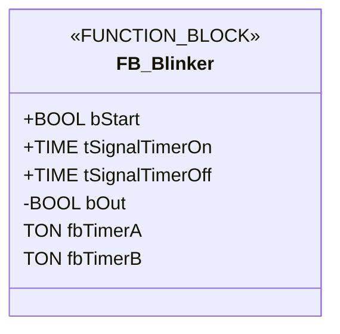

# FB_Blinker

> **POU Type:** FUNCTION_BLOCK  
> **Source:** `FB_Blinker.TcPOU`  
> **Implementation Language:** FBD (Function Block Diagram)

## Declaration

```mermaid
classDiagram
    class FB_Blinker {
        <<FUNCTION_BLOCK>>
        +BOOL bStart
        +TIME tSignalTimerOn
        +TIME tSignalTimerOff
        -BOOL bOut
        TON fbTimerA
        TON fbTimerB
    }
```

## Implementation (FBD) — Network 1

```mermaid
%%{ init: { 'flowchart': { 'curve': 'stepAfter' } } }%%
flowchart LR
    %% --- Operands / Variables ---
    bStart(["bStart"])
    fbTimerBQ(["fbTimerB.Q"])
    tSignalTimerOn(["tSignalTimerOn"])
    tSignalTimerOff(["tSignalTimerOff"])

    %% --- Function Blocks & Operators ---
    TON_B[["TON
    fbTimerB"]]
    TON_A[["TON
    fbTimerA"]]
    AND1{{"AND (&)"}}

    %% --- Bifurcation Junctions ---
    J_TON_A_Q(( )):::junction

    %% --- Outputs ---
    bOut(["bOut"])

    %% --- Wiring ---
    AND1 -- "IN" --> TON_A
    bStart --> AND1
    fbTimerBQ -. "○ (negated)" .-> AND1
    tSignalTimerOn -- "PT" --> TON_A
    TON_A -- "Q" --> J_TON_A_Q
    J_TON_A_Q --> bOut
    J_TON_A_Q -- "IN" --> TON_B
    tSignalTimerOff -- "PT" --> TON_B

    classDef junction fill:#333,stroke:#333,width:6px,height:6px
```
