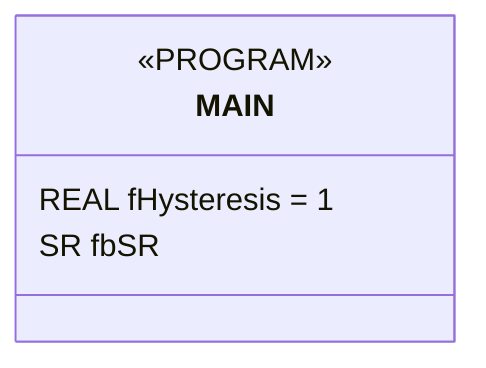

# MAIN

> **POU Type:** PROGRAM  
> **Source:** `MAIN.TcPOU`  
> **Implementation Language:** CFC (Continuous Function Chart)

## Declaration

```mermaid
classDiagram
    class MAIN {
        <<PROGRAM>>
        REAL fHysteresis = 1
        SR fbSR
    }
```

## Implementation (CFC)

```mermaid
%%{ init: { 'flowchart': { 'curve': 'stepAfter' } } }%%
flowchart LR
    %% --- Input Variables ---
    fTempSet(["GVL_Var.fTempSet"])
    fHysteresis(["fHysteresis"])
    fTempActual(["GVL_Var.fTempActual"])

    %% --- Bifurcation Junctions ---
    J_fTempSet(( )):::junction
    J_fHysteresis(( )):::junction
    J_fTempActual(( )):::junction

    %% --- Operators ---
    ADD1{{"ADD"}}
    LT1{{"LT"}}
    SUB1{{"SUB"}}
    GT1{{"GT"}}

    %% --- Function Blocks ---
    SR1[["SR
    fbSR"]]

    %% --- Program Calls ---
    Signals[[" Signals"]]

    %% --- Output Variables ---
    bCompressor(["GVL_Var.bCompressor"])

    %% --- Wiring ---
    fTempSet --> J_fTempSet
    J_fTempSet --> ADD1
    J_fTempSet --> SUB1
    fHysteresis --> J_fHysteresis
    J_fHysteresis --> ADD1
    J_fHysteresis --> SUB1
    ADD1 --> GT1
    fTempActual --> J_fTempActual
    J_fTempActual --> GT1
    J_fTempActual --> LT1
    GT1 -- "SET1" --> SR1
    SUB1 --> LT1
    LT1 -- "RESET" --> SR1
    SR1 -- "Q1" --> bCompressor

    classDef junction fill:#333,stroke:#333,width:6px,height:6px
```
